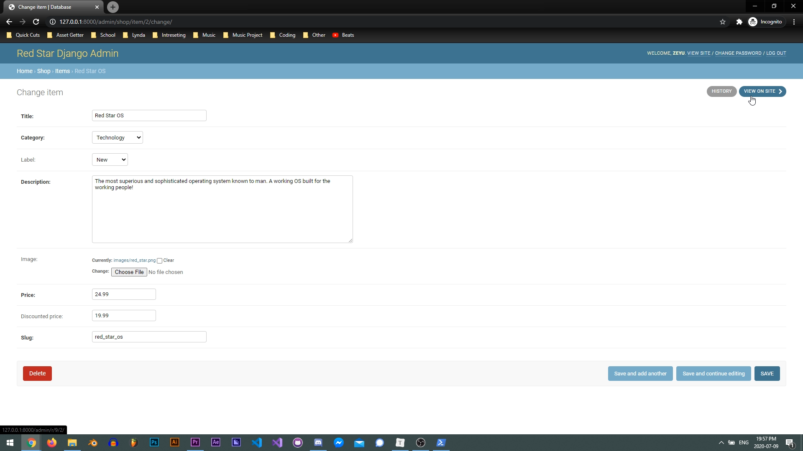
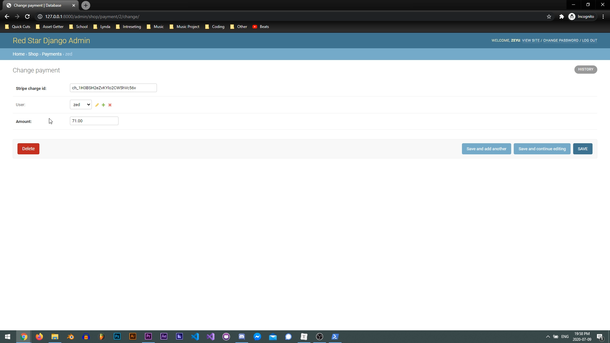

# Django Ecommerce App

## General

This is the successor of [django_ecommerse_app_deprecated](https://github.com/Zeyu-Li/django_ecommerse_app_deprecated)

This is a Django Ecommerce App with login and a shopping cart. To add new items, sign in as admin and go to Item -> + Item (top right). 


## How to use

To start, follow this tutorial: https://github.com/Zeyu-Li/django-tutorial#1-getting-started till **`pip install -r requirements.txt`**


Afterwards, to move into the project enter

```powershell
open.ps1 # in powershell
```

if you are on Windows

OR

```shell
open.sh # in terminal
```

if you are on Mac or Linux


You then want to makemigrations and migrate with

```shell
py manage.py makemigrations #then
py manage.py migrate
```

 Afterwards, you want an admin account so do

```
py manage.py createsuperuser
```

and follow the prompts


Now you are set up and can do 

```shell
py manage.py runserver
```

and open the development server of http://127.0.0.1:8000/


no such column error?

```shell
python manage.py migrate --run-syncdb
```


## Demo


^ sorry about the bad quality, size restrictions :(


Adding a new item



Purchase



## Dependencies/Modules

* [virtualenv](https://docs.python.org/3/tutorial/venv.html)
* [Django](https://www.djangoproject.com/)
* [django-crispy-forms](https://django-crispy-forms.readthedocs.io/en/latest/)
* [django-recaptcha](https://pypi.org/project/django-recaptcha/)
* [django-countries](https://github.com/SmileyChris/django-countries)
* [Pillow](https://pypi.org/project/Pillow/) - for product images
* [stripe](https://pypi.org/project/stripe/) - for purchasing


## Reuse

This code is under MIT licence.

